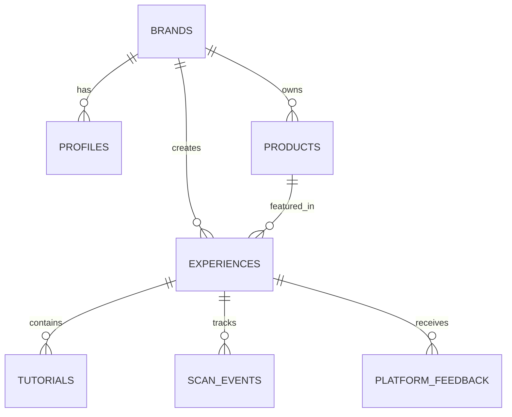
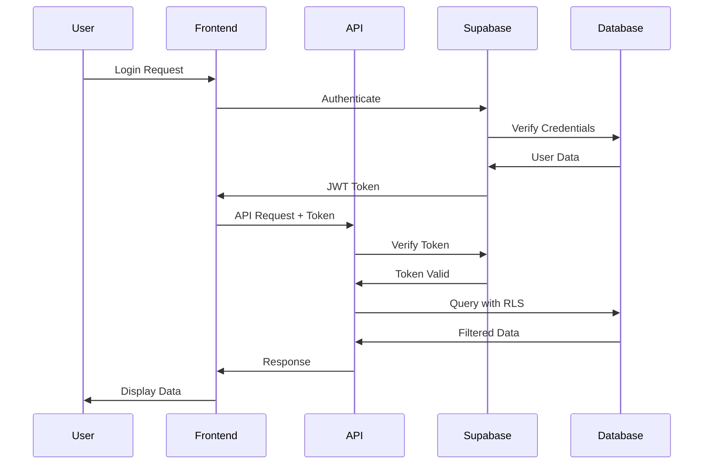
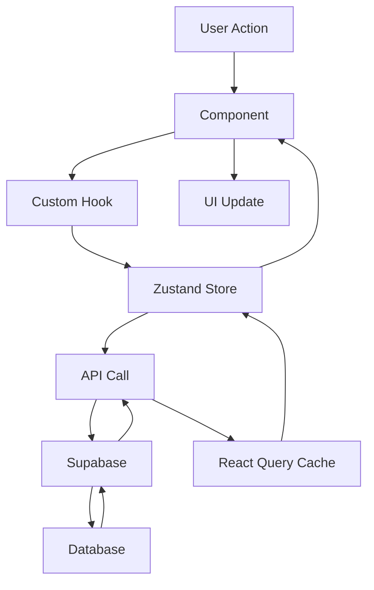

# Architecture Documentation

## System Overview

Cxperia is built as a modern, scalable web application using Next.js 15 with a comprehensive architecture that supports both brand management and end-user experiences.

## 🏗️ High-Level Architecture

```
┌─────────────────┐    ┌─────────────────┐    ┌─────────────────┐
│   Brand Users   │    │   End Users     │    │   Administrators│
│   (Dashboard)   │    │   (Mobile Web)  │    │   (Admin Panel) │
└─────────┬───────┘    └─────────┬───────┘    └─────────┬───────┘
          │                      │                      │
          └──────────────────────┼──────────────────────┘
                                 │
                    ┌─────────────▼─────────────┐
                    │      Next.js Frontend     │
                    │   (App Router + React)    │
                    └─────────────┬─────────────┘
                                 │
                    ┌─────────────▼─────────────┐
                    │     Next.js API Routes    │
                    │   (Serverless Functions)  │
                    └─────────────┬─────────────┘
                                 │
          ┌──────────────────────┼──────────────────────┐
          │                      │                      │
┌─────────▼───────┐    ┌─────────▼───────┐    ┌─────────▼───────┐
│    Supabase     │    │   Cloudinary    │    │   Upstash       │
│   (Database +   │    │   (Media CDN)   │    │   (Redis Cache) │
│   Auth + RLS)   │    │                 │    │                 │
└─────────────────┘    └─────────────────┘    └─────────────────┘
```

## 🎯 Core Components

### Frontend Architecture

#### Next.js App Router
- **File-based Routing**: Automatic route generation
- **Server Components**: Optimized server-side rendering
- **Client Components**: Interactive client-side features
- **Middleware**: Authentication and routing logic

#### React Architecture
- **React 19**: Latest React features and concurrent rendering
- **TypeScript**: Type-safe development
- **Component Library**: Reusable UI components
- **Custom Hooks**: Business logic abstraction

#### State Management
- **Zustand**: Global state management
- **React Query**: Server state and caching
- **Context API**: Component-level state
- **Local Storage**: Client-side persistence

### Backend Architecture

#### API Layer
- **Next.js API Routes**: Serverless API endpoints
- **Middleware**: Authentication and validation
- **Error Handling**: Centralized error management
- **Rate Limiting**: API protection

#### Database Layer
- **Supabase**: PostgreSQL database
- **Row Level Security**: Data access control
- **Real-time**: Live data updates
- **Migrations**: Schema versioning

#### External Services
- **Cloudinary**: Media storage and optimization
- **Upstash Redis**: Caching and sessions
- **Vercel**: Hosting and deployment

## 📊 Database Schema

### Core Tables

#### Users and Authentication
```sql
-- Profiles table
CREATE TABLE profiles (
  id UUID PRIMARY KEY REFERENCES auth.users(id),
  brand_id UUID REFERENCES brands(id),
  email TEXT UNIQUE NOT NULL,
  full_name TEXT,
  avatar_url TEXT,
  created_at TIMESTAMP DEFAULT NOW(),
  updated_at TIMESTAMP DEFAULT NOW()
);

-- Brands table
CREATE TABLE brands (
  id UUID PRIMARY KEY DEFAULT gen_random_uuid(),
  name TEXT NOT NULL,
  logo_url TEXT,
  primary_color TEXT,
  secondary_color TEXT,
  created_at TIMESTAMP DEFAULT NOW()
);
```

#### Experiences
```sql
-- Experiences table
CREATE TABLE experiences (
  id UUID PRIMARY KEY DEFAULT gen_random_uuid(),
  brand_id UUID REFERENCES brands(id),
  product_id UUID REFERENCES products(id),
  name TEXT NOT NULL,
  description TEXT,
  slug TEXT UNIQUE NOT NULL,
  is_published BOOLEAN DEFAULT false,
  primary_color TEXT,
  features JSONB DEFAULT '{}',
  created_at TIMESTAMP DEFAULT NOW(),
  updated_at TIMESTAMP DEFAULT NOW()
);

-- Products table
CREATE TABLE products (
  id UUID PRIMARY KEY DEFAULT gen_random_uuid(),
  brand_id UUID REFERENCES brands(id),
  name TEXT NOT NULL,
  description TEXT,
  category TEXT,
  price DECIMAL,
  image_url TEXT,
  created_at TIMESTAMP DEFAULT NOW()
);
```

#### Tutorials
```sql
-- Tutorials table
CREATE TABLE tutorials (
  id UUID PRIMARY KEY DEFAULT gen_random_uuid(),
  experience_id UUID REFERENCES experiences(id),
  title TEXT NOT NULL,
  description TEXT,
  category TEXT,
  difficulty TEXT,
  steps JSONB DEFAULT '[]',
  featured_image TEXT,
  featured_video_url TEXT,
  is_published BOOLEAN DEFAULT false,
  views INTEGER DEFAULT 0,
  created_at TIMESTAMP DEFAULT NOW(),
  updated_at TIMESTAMP DEFAULT NOW()
);
```

#### Analytics
```sql
-- Scan events table
CREATE TABLE scan_events (
  id UUID PRIMARY KEY DEFAULT gen_random_uuid(),
  experience_id UUID REFERENCES experiences(id),
  user_agent TEXT,
  ip_address INET,
  country TEXT,
  city TEXT,
  created_at TIMESTAMP DEFAULT NOW()
);

-- Platform feedback table
CREATE TABLE platform_feedback (
  id UUID PRIMARY KEY DEFAULT gen_random_uuid(),
  experience_id UUID REFERENCES experiences(id),
  rating INTEGER CHECK (rating >= 1 AND rating <= 5),
  comment TEXT,
  user_email TEXT,
  created_at TIMESTAMP DEFAULT NOW()
);
```

### Relationships



## 🔐 Security Architecture

### Authentication Flow



### Row Level Security (RLS)

```sql
-- Example RLS policies
CREATE POLICY "Users can view own profile" ON profiles
  FOR SELECT USING (auth.uid() = id);

CREATE POLICY "Brands can manage own experiences" ON experiences
  FOR ALL USING (
    brand_id IN (
      SELECT brand_id FROM profiles 
      WHERE id = auth.uid()
    )
  );

CREATE POLICY "Public can view published experiences" ON experiences
  FOR SELECT USING (is_published = true);
```

### API Security

- **JWT Authentication**: Secure token-based auth
- **Rate Limiting**: Prevent API abuse
- **CORS Configuration**: Cross-origin request control
- **Input Validation**: Zod schema validation
- **SQL Injection Prevention**: Parameterized queries

## 🚀 Performance Architecture

### Caching Strategy

#### Multi-Layer Caching
```
┌─────────────────┐
│   Browser Cache │ ← Static assets, images
├─────────────────┤
│   CDN Cache      │ ← Cloudinary, Vercel Edge
├─────────────────┤
│   Redis Cache    │ ← API responses, sessions
├─────────────────┤
│   Database Cache │ ← Query results, indexes
└─────────────────┘
```

#### React Query Caching
```typescript
// Example query configuration
const { data, isLoading } = useQuery({
  queryKey: ['experiences', brandId],
  queryFn: () => fetchExperiences(brandId),
  staleTime: 5 * 60 * 1000, // 5 minutes
  cacheTime: 10 * 60 * 1000, // 10 minutes
  refetchOnWindowFocus: false,
});
```

### Optimization Techniques

#### Frontend Optimization
- **Code Splitting**: Dynamic imports for routes
- **Image Optimization**: Next.js Image component
- **Bundle Analysis**: Webpack bundle analyzer
- **Tree Shaking**: Remove unused code
- **Lazy Loading**: Component lazy loading

#### Backend Optimization
- **Database Indexing**: Optimized query performance
- **Connection Pooling**: Efficient database connections
- **Query Optimization**: Optimized SQL queries
- **Caching**: Redis for frequent queries

## 📱 Mobile Architecture

### Responsive Design
- **Mobile-First**: CSS approach
- **Breakpoints**: Tailwind responsive classes
- **Touch Optimization**: Touch-friendly interactions
- **Performance**: Optimized for mobile networks

### PWA Features
- **Service Worker**: Offline functionality
- **Manifest**: App-like experience
- **Push Notifications**: User engagement
- **Installation**: Add to home screen

## 🔄 Data Flow Architecture

### State Management Flow



### Real-time Updates

```typescript
// Supabase real-time subscription
const subscription = supabase
  .channel('experiences')
  .on('postgres_changes', {
    event: 'UPDATE',
    schema: 'public',
    table: 'experiences'
  }, (payload) => {
    // Update local state
    updateExperienceInStore(payload.new);
  })
  .subscribe();
```

## 🧪 Testing Architecture

### Testing Strategy

#### Unit Testing
- **Vitest**: Fast unit testing
- **React Testing Library**: Component testing
- **Jest**: Test utilities and mocking

#### Integration Testing
- **API Testing**: Endpoint testing
- **Database Testing**: Query testing
- **Authentication Testing**: Auth flow testing

#### E2E Testing
- **Playwright**: End-to-end testing
- **Cross-browser**: Multiple browser testing
- **Mobile Testing**: Mobile device testing

### Test Structure
```
tests/
├── unit/           # Unit tests
├── integration/    # Integration tests
├── e2e/           # End-to-end tests
└── fixtures/      # Test data
```

## 📊 Monitoring Architecture

### Observability Stack

#### Application Monitoring
- **Vercel Analytics**: Performance metrics
- **Error Tracking**: Error monitoring
- **Uptime Monitoring**: Service availability
- **Custom Metrics**: Business metrics

#### Infrastructure Monitoring
- **Database Monitoring**: Query performance
- **API Monitoring**: Endpoint performance
- **Cache Monitoring**: Redis performance
- **CDN Monitoring**: Cloudinary performance

### Logging Strategy

```typescript
// Structured logging
const logger = {
  info: (message: string, meta?: object) => {
    console.log(JSON.stringify({
      level: 'info',
      message,
      timestamp: new Date().toISOString(),
      ...meta
    }));
  },
  error: (message: string, error?: Error, meta?: object) => {
    console.error(JSON.stringify({
      level: 'error',
      message,
      error: error?.stack,
      timestamp: new Date().toISOString(),
      ...meta
    }));
  }
};
```

## 🔧 Development Architecture

### Development Workflow

#### Code Organization
```
src/
├── app/              # Next.js App Router
├── components/       # Reusable components
├── hooks/            # Custom React hooks
├── lib/              # Utility libraries
├── services/         # API services
├── store/            # State management
├── types/            # TypeScript types
└── utils/            # Helper functions
```

#### Build Process
1. **TypeScript Compilation**: Type checking
2. **ESLint**: Code linting
3. **Prettier**: Code formatting
4. **Next.js Build**: Production build
5. **Bundle Analysis**: Size optimization

### CI/CD Pipeline

```yaml
# GitHub Actions workflow
name: CI/CD Pipeline
on: [push, pull_request]

jobs:
  test:
    runs-on: ubuntu-latest
    steps:
      - uses: actions/checkout@v3
      - uses: actions/setup-node@v3
      - run: pnpm install
      - run: pnpm test
      - run: pnpm lint
      - run: pnpm build

  deploy:
    needs: test
    runs-on: ubuntu-latest
    if: github.ref == 'refs/heads/main'
    steps:
      - uses: actions/checkout@v3
      - uses: vercel/action@v1
```

## 🚀 Scalability Considerations

### Horizontal Scaling
- **Stateless API**: Serverless functions
- **Database Scaling**: Supabase scaling
- **CDN Distribution**: Global content delivery
- **Load Balancing**: Traffic distribution

### Vertical Scaling
- **Database Optimization**: Query optimization
- **Caching Strategy**: Multi-layer caching
- **Code Optimization**: Performance improvements
- **Resource Monitoring**: Resource usage tracking

## 📚 Additional Resources

- **[API Documentation](../api/README.md)** - API architecture details
- **[Component Library](../components/README.md)** - Frontend component architecture
- **[Database Schema](./database-schema.md)** - Detailed database design
- **[Security Guide](../security/security-overview.md)** - Security architecture
- **[Performance Guide](../maintenance/performance-optimization.md)** - Performance architecture
